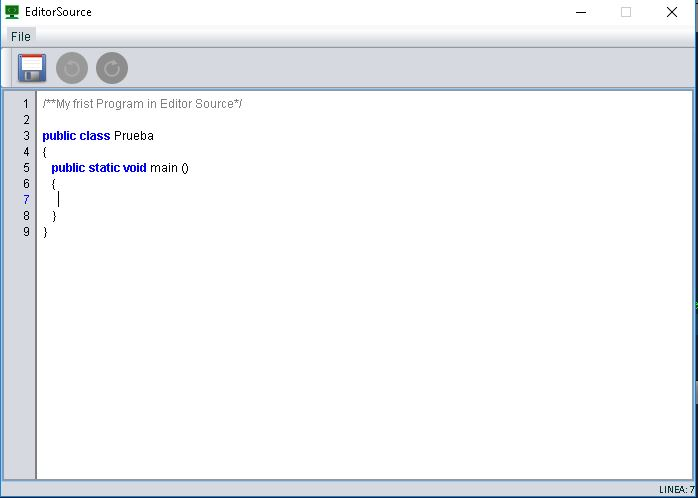

# EditorSource
This repository is to implement refactoring techniques in java

## Description
It is a simple application, but the code smells are applied, which help to improve the readability of the source code. 

## Objetive
It is a simple source code editor, which uses syntax highlighting for the source code

## What is my reason for programming it, if others already exist?
learn refactoring techniques, and mainly have fun

## Window Editor Source
